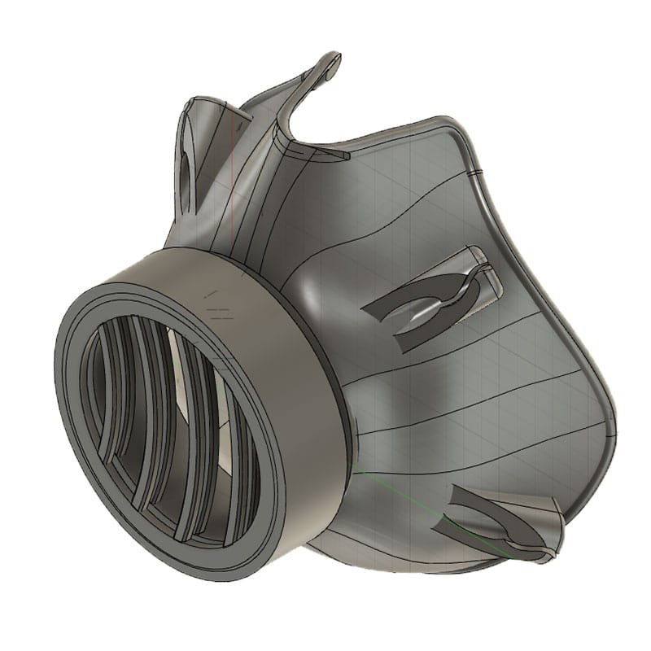
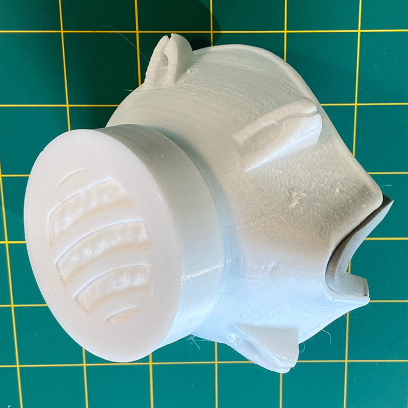
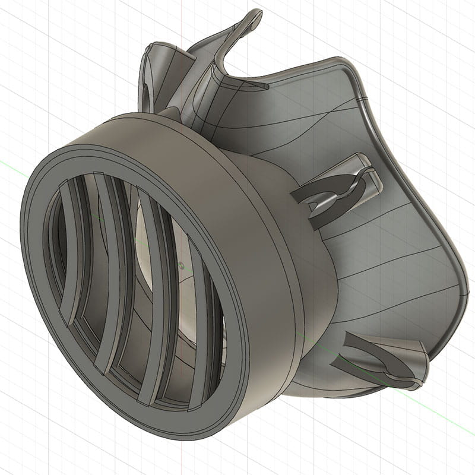
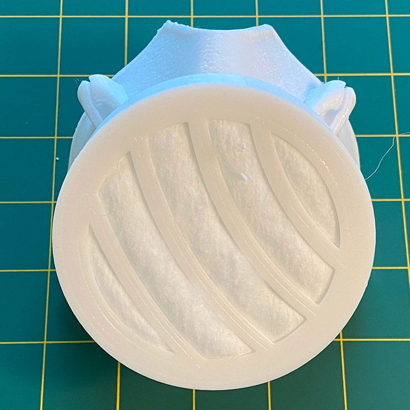

# MC20 Series 3D Printable Respirator

These designs are free to download and print for use.

Contact us (contact@epvisual.com) to request use of our two available 3-D printers.

**Note**: Unlike N95 respirators, our respirator designs are not evaluated, tested, and approved by the National Institute for Occupational Safety and Health (NIOSH) as per the requirements in 42 CFR Part 84.

## Background

An N95 respiratory protective device is designed to achieve a very close facial fit and very efficient filtration of airborne particles. These respirators are fluid resistant, disposable, and currently used in hospitals to protect staff from coronavirus. Non-disposable, rated respirators with replaceable filters are a better option; but they are hard to clean, expensive, proprietary, and the filters are not readily available.

Because the N95 respirator is more expensive and supplies are low, hospital staff are often using the disposable, loose-fitting surgical face masks as an alternative. Though these are designed to be thrown away after one use, hospital staff are often reusing them due to the low supplies of personal protective equipment (PPE). These masks are not designed to form a seal around the nose and mouth, and all disposable masks are easily damaged when attempting to wash and reuse.

## The Current Situation

### Availability

N95 respirators are not readily available and, if available, are expensive.

### Level of Protection

Disposable masks do not provide the same level of protection. Loose-fitting disposable surgical masks are not designed to form a seal around the nose and mouth.

### Possible Reuse

Disposable masks are not meant for reuse. You cannot properly clean disposable masks without risking damage to layers of the mask.

In response to this pandemic of the 2019 novel coronavirus, COVID-19, many individuals and companies are contributing resources and services in ways that they are able.

As a company with 3-D design and printing capabilities, we want to contribute our designs to create PPE that may be useful in keeping hospital staff safe as they care for sick patients and battle the coronavirus.

Our hope with this open source project is to provide a:

* Usable respirator that can be printed now to fill current availability gaps
* Sturdier, safer option than homemade fabric masks
* Two-piece respirator that is easy to clean with disposable padding and filters
* Product that can be tested, peer reviewed, and refined by experts in the field

## Our Solution

### Share

EP Visual wants to share and allow for free use of our respirator designs in an open source platform. We want to encourage further development and get additional user feedback.

### Protect

Our respirator designs are made to incorporate any approved filter media that can be made to fit the two sizes. We have experimented with a cotton layer, activated carbon layer, and MERV 14 layer with comfortable breathing and have achieved what seems like a good seal.

### Reuse

Our solid designs are made for reuse. Nooks and crannies are minimized, and polycarbonate printing filament is both chemical, water, and heat resistant. The reusable padding/seals can be customized, removed, and easily replaced.

**Note:** Unlike N95 respirators, our respirator designs are not evaluated, tested, and approved by the National Institute for Occupational Safety and Health (NIOSH) as per the requirements in 42 CFR Part 84.

## MC2055

### 55mm filter media

* **MC2055N**: Supports a  55mm diameter X  15mm thick round filter.
* **MC2055NS**: Supports a 55mm diameter X 5mm filter. Slimmer design, smaller, prints fastest.
* **MC2055NS-K**: MC2055NS - scaled to 80% for kids.

Additional images available in the images directory.

## MC2080

### 80mm filter media

* **MC2080N**: Supports an 80mm diameter X 15mm thick round filter.
* **MC2080NS**: Supports an 80mm diameter X 5mm thick round filter. Slimmer design, smaller, prints faster.
* **MC2080NS-H****: MC2080NS that includes a hydration portal and storage for a 7mm, medical grade silicone tube.

Additional images available in the images directory.

## Additional Information

We have printed these respirators out of polycarbonate with flexible filter options. Currently we are experimenting with a multi-layer filter. The first layer is made of a cotton disk and the second layer is made with Merv 14 filter media. Both layers are cut into 55mm and 80mm circles. We have also added an activated carbon filter layer which produces comfortable breathing results. For the seal around the nose area, we have trialed both a silicone gasket and foam tape. The seal, along with filter material, is designed to be thrown away before sterilizing. Though not officially evaluated by an authoritative source, we believe these respirators work better than the fabric masks because there is a more effective seal around the nose and mouth.

With further testing, we hope to find a way to make it easier to secure the filter media without any gaps. We tested options with removable grids, but ultimately decided that additional parts may create risks with cleaning and the potential for missing pieces. As part of our experimentation with the respirator, we developed a secondary, internal filter cartridge, but were not able to consistently get it to seal, which resulted in making cleaning difficult.

Future product improvement opportunities:

* Develop filter standards and work with filter makers to produce a non-proprietary replacement filter
* Create a version for general use that is lightweight, subtle, and more comfortable for everyday wear
* Create child-size versions

## Cleaning/Care

Our masks are designed to be easy to clean.

Because the coronavirus lives on plastic for three days, the respirators need to be disinfected after each use with bleach or alcohol. Ultimaker polycarbonate and Polymaker POLYMAX PC are both heat and chemical resistant and don’t absorb water. We have read on some Autoclave manufacturers websites that polycarbonate can be disinfected in a standard Autoclave, but we have not tested this with these printed respirators. If printed in polycarbonate, DO NOT use alkaline cleaners like ammonia or lye.

## Printing Specifications

### Materials Used

* Polymaker PolyMax PC – White
* Ultimaker White PC

### Printers Used

* Ultimaker S5
* Ultimaker S3

### Printer Details

* Print Nozzle used: Ultimaker 0.8mm
* Most settings: Default for material
* Layer heights tested: 0.2mm, 0.3mm, 0.4mm
* Infill: 100% (limit the gaps in the respirator print)
* Support: OFF (with the surface area of the model and the adhesion bodies included in the model, we have had success with no support)
* Build Plate Adhesion: OFF

## Resources

* [FDA N95 Respirators and Surgical Masks (Face Masks)](https://www.fda.gov/medical-devices/personal-protective-equipment-infection-control/n95-respirators-and-surgical-masks-face-masks)
* [CDC Strategies for Optimizing the Supply of N95 Respirators: Crisis/Alternate Strategies](https://www.cdc.gov/coronavirus/2019-ncov/hcp/respirators-strategy/crisis-alternate-strategies.html)
* [CDC: Understanding the Difference - Surgical Mask vs. N95 Respirator](https://www.cdc.gov/niosh/npptl/pdfs/UnderstandDifferenceInfographic-508.pdf)

### Where to Find Supplies

#### Straps (Any elastic material can work)

* [Grifiti Band Joes X Cross Style 12" Assorted Color 10 Pack Cooking Grade, Pressure Cooker, Crock Pot, Puzzles, Board Games Heat Cold UV Chemical Resistant Silicone Rubber by Grifiti](https://www.amazon.com/dp/B00GLJ421W/ref=cm_sw_em_r_mt_dp_U_HhZHEb0QJJ882)
* [Coopay Large Heavy Duty Latex Rubber Bands Trash Can Bands for Office Supply, File Folders, Cat Litter Box, Size 12 inches, 30 Pack (White) by Coopay US](https://www.amazon.com/dp/B07VNC7X93/ref=cm_sw_em_r_mt_dp_U_xiZHEbRNAAG2Z)

#### Seal and comfort tape as needed

* [Nexcare Absolute Waterproof Tape, Hypoallergenic, 1 Inch x 5 Yard Roll, 6 Rolls by Amazon.com](https://www.amazon.com/dp/B07GSQJH19/ref=cm_sw_em_r_mt_dp_U_YvZHEbYSG2HSN)
* [3M 2770-2 Kind Removal Silicone Tape (Pack of 6) by Simply Prime](https://www.amazon.com/dp/B00KHVWXWA/ref=cm_sw_em_r_mt_dp_U_JxZHEbH61C4V0)
